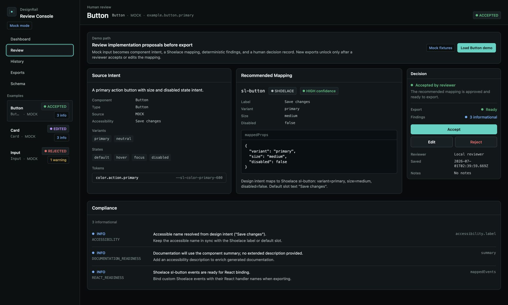
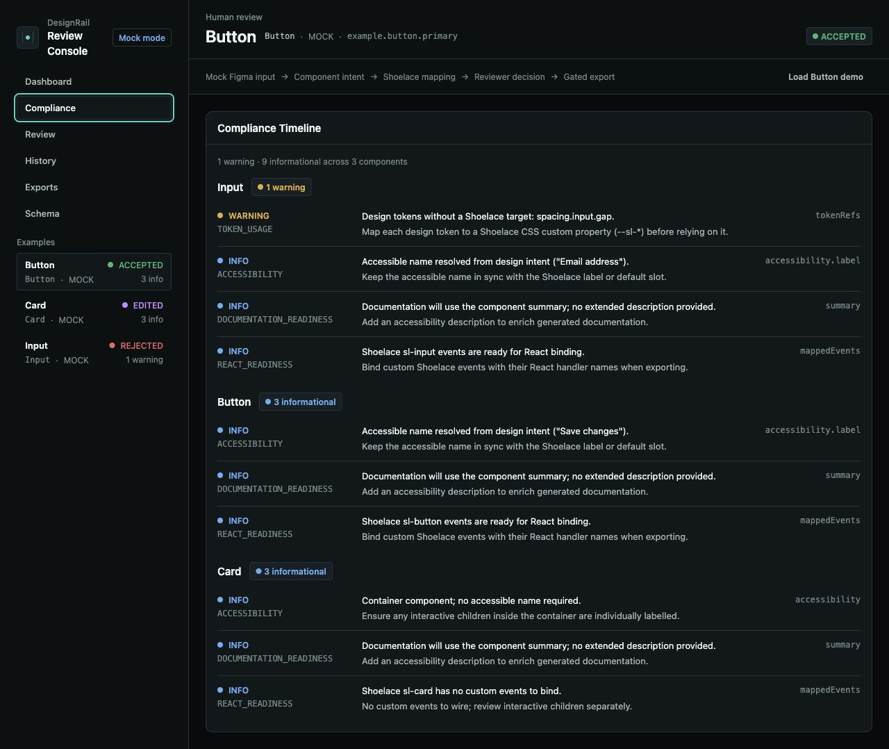
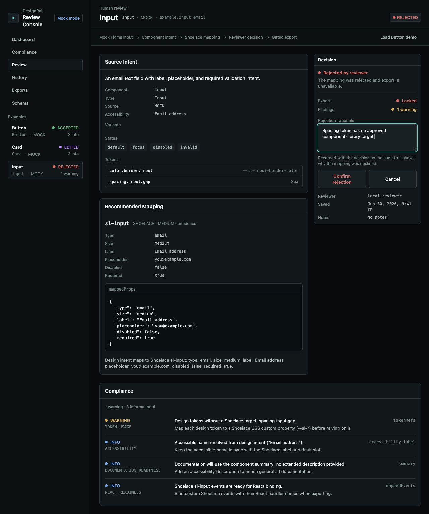
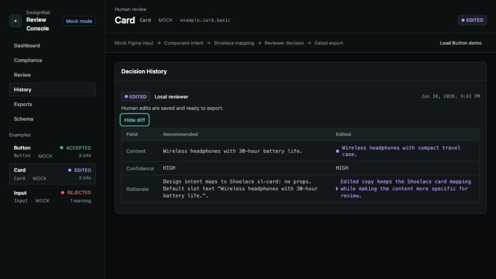
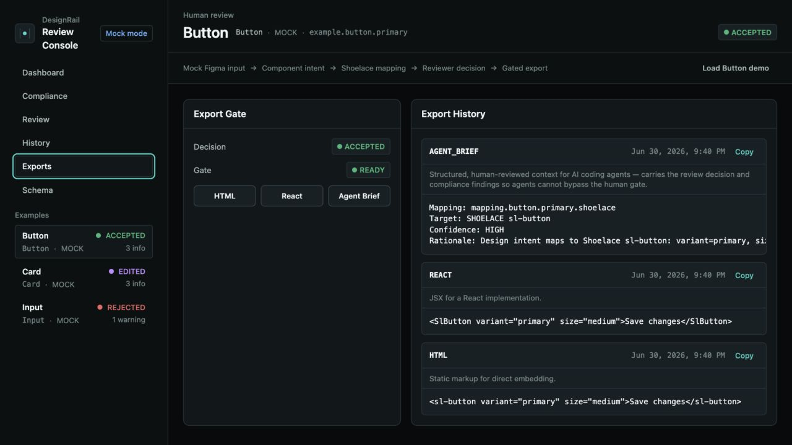

# DesignRail

[](https://github.com/connordibble/DesignRail/actions/workflows/check.yml)

DesignRail is a human review gate for design-to-code workflows. It surfaces schema-backed component proposals and compliance risks before a developer authorizes export.

[](assets/demo-input-intent.png)

[Demo download · 2.7 MB](https://raw.githubusercontent.com/connordibble/DesignRail/main/assets/designrail-demo.mp4) · [Run locally](#run-it-locally) · [Architecture](#architecture)

The demo is local, credential-free, and backed by public mock fixtures. Generation never bypasses review, so the handoff decision stays visible and auditable.

## Run it locally

Requires Node 20+, pnpm 10+, and `ripgrep`.

```sh
pnpm install
pnpm check
pnpm dev
```

Open `http://localhost:5173/` and choose **Load Button demo**. The web app runs on port 5173 and the Fastify/Apollo API on port 4000. No Figma token or external AI service is required.

## What to review

1. **Intent:** inspect normalized component semantics, states, accessibility metadata, and token references.
2. **Proposal:** compare the recommended Shoelace component, props, slots, confidence, and rationale with deterministic compliance findings.
3. **Decision:** accept the proposal, edit it against the component schema, or reject it with a required rationale.
4. **Audit:** revisit the decision timeline and expand edited entries to see what changed from the recommendation.
5. **Export:** generate HTML, React, or Agent Brief output only after an accepted or edited decision.

The selected example and workspace view are stored in the URL, so a review state can be refreshed, shared, and restored with browser navigation.

## Product proof

Open any image for the full-resolution view.

<table>
  <tr>
    <th scope="col">Compliance ledger</th>
    <th scope="col">Required rejection rationale</th>
  </tr>
  <tr>
    <td valign="top"><a href="assets/demo-compliance.png"></a></td>
    <td valign="top"><a href="assets/demo-rejection-rationale.png"></a></td>
  </tr>
  <tr>
    <th scope="col">Decision diff</th>
    <th scope="col">Reviewed Agent Brief</th>
  </tr>
  <tr>
    <td valign="top"><a href="assets/demo-history-diff.png"></a></td>
    <td valign="top"><a href="assets/demo-agent-brief.png"></a></td>
  </tr>
</table>

[Download the captioned demo (MP4, 2.7 MB)](https://raw.githubusercontent.com/connordibble/DesignRail/main/assets/designrail-demo.mp4), read the [caption transcript](assets/designrail-demo.vtt), or follow [the live demo script](DEMO_SCRIPT.md).

## What is shipped

- A responsive React review console with Dashboard, Compliance, Review, History, Exports, and Schema views.
- Public-safe Button, Input, and Card fixtures that exercise variants, states, tokens, accessibility metadata, warnings, decisions, and exports.
- Schema-driven mapping to Shoelace Web Components with explicit confidence, rationale, props, slots, and fallback notes.
- Deterministic compliance findings with severity, path, explanation, and remediation.
- Persisted accept, reject, and edit decisions; rejection requires a rationale and edited decisions retain a field-level diff.
- An export gate that permits new HTML, React, and Agent Brief output only for accepted or edited mappings.
- GraphQL-backed UI instrumentation for review navigation, retries, decisions, exports, and copy outcomes.
- A local SQLite store, strict TypeScript, Zod validation, GraphQL drift checks, and a repeatable quality gate.

## Architecture

<a href="assets/architecture.svg">
  <picture>
    <source media="(max-width: 600px)" srcset="assets/architecture-mobile.svg" />
    
  </picture>
</a>

GraphQL is the contract between the UI, API, and persistence layer. The UI reads a complete review workspace and writes decisions, exports, and client instrumentation through typed operations. Pipeline tools generate deterministic fixture-backed data but do not bypass the human gate.

```text
apps/web/                React + Vite review console
apps/api/                Fastify + Apollo GraphQL API and SQLite ownership
packages/shared/         Domain schemas and GraphQL contract
packages/schema/         Shoelace component schemas
packages/design-tokens/  Token-to-CSS-variable mapping
tools/figma-import/      Fixture to normalized intent
tools/component-mapper/  Intent to component proposal
tools/compliance-agent/  Proposal to structured findings
```

Read [the architecture overview](docs/architecture.md) for the URL contract, decision model, instrumentation mutation, and production adapter boundary. The two ADRs cover [Tailwind and Shoelace](docs/src/content/docs/decisions/0001-tailwind-and-shoelace.md) and [GraphQL with SQLite](docs/src/content/docs/decisions/0002-graphql-and-sqlite-review-contract.md).

## Deliberate tradeoffs

- **Mock mode first.** The repository stays useful without private Figma files or credentials. A live adapter is deferred behind the normalized intent boundary.
- **One component library.** Shoelace keeps the mapping contract concrete. Broader design-system support should arrive as additional schemas, not looser guesses.
- **Deterministic compliance.** Local rules are reproducible and testable, but they do not replace an accessibility audit or product-specific review.
- **Local persistence.** SQLite makes the full review loop easy to run. Multi-user identity, authorization, tenancy, and hosted storage are outside the current boundary.
- **Proposal, not authority.** Confidence and rationale are visible because a generated mapping can still be wrong. A human decision remains the export authority.

## Production boundary

The production-shaped seam is the `ComponentIntent` contract. A live Figma MCP or API adapter can replace the fixture reader only when explicitly configured, while mapping, compliance, review, persistence, and export continue to use the same types.

A hosted deployment would also need authentication, authorization, multi-user review ownership, durable storage, observability, rate limits, and CI integration. None of those are implied by the local demo. The API binds to localhost by default; set `HOST` and `DESIGNRAIL_ALLOW_NETWORK=true` only when intentionally exposing it.

## Commands

```sh
pnpm typecheck          # TypeScript and docs diagnostics
pnpm lint               # ESLint
pnpm format:check       # Prettier verification
pnpm readme:check       # README links and proof assets
pnpm test               # Deterministic test suite
pnpm graphql:check      # GraphQL schema and operation drift
pnpm db:check           # SQLite migration drift
pnpm compliance:review # Fixture-backed compliance output
pnpm design:verify      # End-to-end fixture pipeline
pnpm mock-mode:check    # Credential-free defaults
pnpm secrets:check      # Public-safety scan
pnpm check              # Full local gate
pnpm build              # Production builds
```

Pipeline entry points:

```sh
pnpm design:import
pnpm design:map
pnpm compliance:review
pnpm design:verify
```

See [ROADMAP.md](ROADMAP.md) for planned work and [AGENTS.md](AGENTS.md) for the repository's implementation and public-safety rules.

## Versioning

DesignRail uses Conventional Commits. Run `pnpm release:plan` to inspect the next SemVer bump from commits since the latest tag. The default workflow must remain public-safe: do not add proprietary design files, private URLs, real credentials, or hidden service dependencies.
