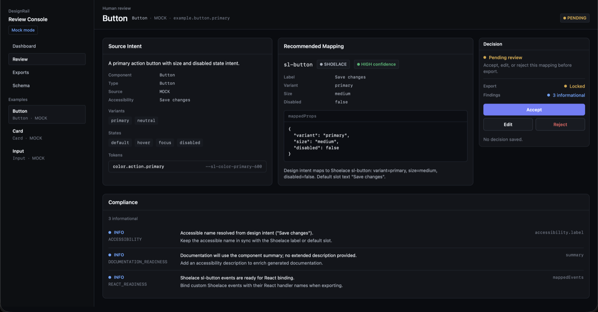
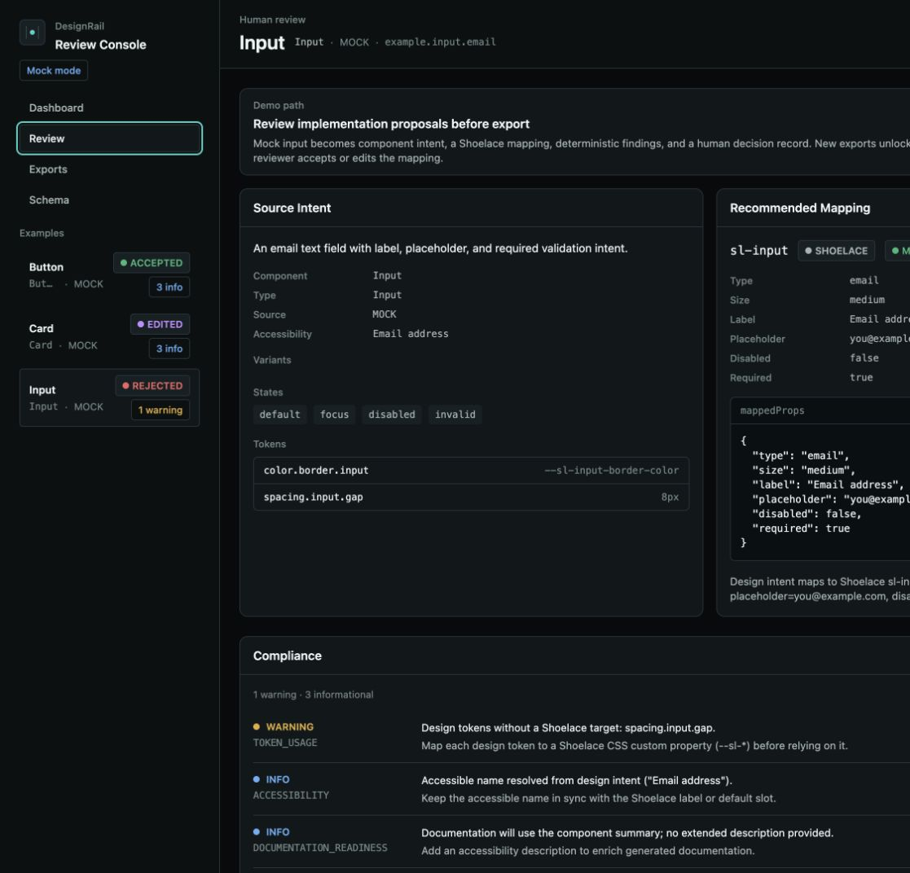
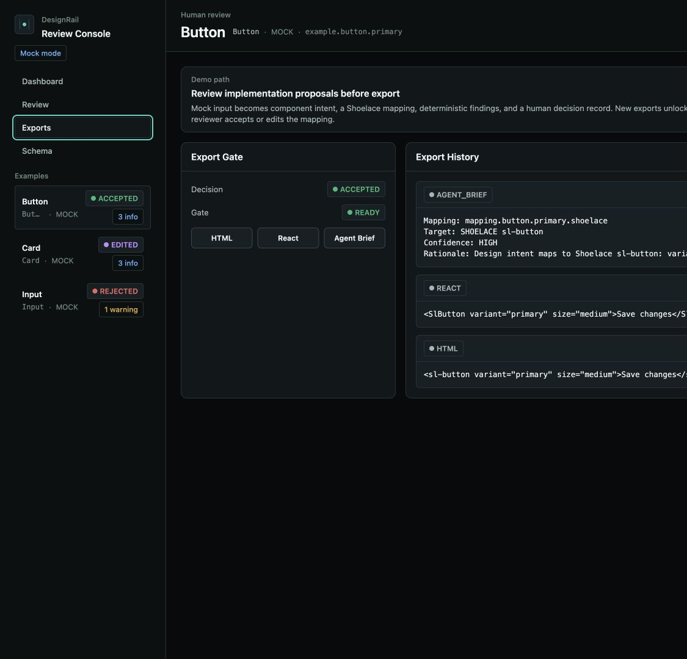

# DesignRail

[](https://github.com/connordibble/DesignRail/actions/workflows/check.yml)

DesignRail is a design-system handoff control plane for AI-assisted implementation. It ingests mock or optional real Figma input, normalizes it into component intent, maps that intent to Shoelace Web Components, runs compliance review, and records human review decisions before anything is treated as export-ready.



DesignRail does not try to replace coding agents, IDEs, or Figma Dev Mode. It sits between design intent and implementation as the governed review layer:

```text
Design intent -> component proposal -> deterministic checks -> human review -> generated code / agent brief
```

Designers and developers can inspect mapping recommendations, see compliance findings, accept, reject, or edit decisions, and export implementation-ready HTML, React examples, or agent-ready briefs. Review decisions are persisted and instrumented through a GraphQL API so mapping quality can be audited over time.

## Problem / Why This Exists

Design-to-code workflows can produce plausible implementation quickly, but the handoff still needs a trustworthy developer experience. Teams need to understand what changed, why a component mapping was proposed, whether it follows the design system, and what a human accepted or rejected before the result enters a codebase.

DesignRail focuses on that review surface. It treats AI-assisted implementation as a workflow for designers and engineers, not just a generation step.

## Why This Matters

- AI generation alone is not enough when design-system fit, accessibility, token usage, and implementation intent need review.
- Teams need reviewable proposals, deterministic checks, and recorded human decisions before generated code enters a production codebase.
- Design systems become the control plane for AI-assisted UI implementation: schemas, tokens, and review gates define what can be exported safely.

## What DesignRail Is For

- Normalize Figma-style design data into reviewable component intent.
- Map design intent to a component-library schema, with Shoelace as the first target.
- Make accessibility, token usage, variant coverage, React readiness, documentation readiness, and design-system alignment visible before implementation.
- Preserve human decisions so accepted, rejected, and edited mappings are auditable.
- Export clean implementation examples and structured context that can be used in CLI, IDE, or agent-assisted coding workflows.
- Measure where design-to-engineering handoff succeeds or repeatedly needs correction.

## What DesignRail Is Not

- A one-click design-to-code generator.
- A replacement for engineers reviewing implementation details.
- A replacement for Figma, Dev Mode, or coding agents.
- A place for proprietary design files, private employer references, or real credentials in the default path.

## Run Locally

```sh
pnpm install
pnpm check    # full quality gate: secrets, mock-mode, types, lint, format, tests
pnpm dev      # runs apps/web (Vite, :5173) and apps/api (Fastify+Apollo, :4000) in parallel
pnpm docs:dev # runs the Astro Starlight docs site
```

Prerequisites: Node 20+ (`.nvmrc`), pnpm 10+, `ripgrep` on PATH for `hooks/no-secrets.sh` and `hooks/mock-mode-check.sh`.

## Demo Workflow

Use `pnpm dev`, open `http://localhost:5173/`, then click **Load Button demo** in the review console.

1. **Input / design intent**: Inspect the Source Intent panel for normalized mock Figma input, accessibility metadata, variants, states, and tokens.
2. **Review / compliance surface**: Compare the recommended Shoelace mapping with deterministic findings and the visible decision gate.
3. **Accepted mapping / generated output**: Accept or edit the proposal, open Exports, and generate HTML, React, or Agent Brief output.

### Demo Video

[Silent 90-second DesignRail demo](assets/designrail-demo.mov)

### Screenshots






## Architecture

DesignRail is a pnpm monorepo with a React review workspace, a Fastify/Apollo GraphQL API, shared schemas, deterministic mapping tools, compliance review, and an Astro Starlight docs site.

```
apps/
  web/                React + Vite + Tailwind review UI
  api/                Fastify + Apollo GraphQL server
packages/
  shared/             Cross-cutting domain types and Zod schemas
  schema/             Shoelace component schemas (props, slots, events, parts) — source of truth for mapping
  design-tokens/      Design tokens → Shoelace CSS custom properties
tools/
  figma-import/       Mock Figma fixture → normalized ComponentIntent
  component-mapper/   Intent → deterministic, schema-driven Shoelace mapping
  compliance-agent/   Mapping + intent → structured compliance findings
examples/             Mock Figma fixtures (Button, Input, Card now; Badge/Dialog/Spinner planned)
docs/                 Astro + Starlight documentation site with ADRs
agents/               DesignRail-specific skill files
hooks/                Repeatable local quality, secrets, and mock-mode checks
```

### Architecture Notes

- **GraphQL contract**: The review UI reads examples, review workspaces, dashboard metrics, decisions, and exports through GraphQL. Persisted decisions and generated exports are mutations, not UI-local state.
- **Validator / deterministic checks**: Shared Zod schemas validate mock input, normalized component intent, mappings, findings, decisions, and exports. The importer, mapper, compliance agent, and `pnpm design:verify` reproduce fixture-backed outputs deterministically.
- **Review decisions**: Human accept, reject, and edit decisions are stored in the API-owned SQLite database with reviewer context and enough data to audit the latest state.
- **Mock / Figma boundary**: Mock fixtures are the default. Optional real Figma or MCP input belongs behind explicit configuration and must normalize into the same `ComponentIntent` contract.
- **Export path**: Only accepted or edited mappings can create new HTML, React, or Agent Brief exports. Rejected or pending mappings keep the export gate locked while historical exports remain audit history.

See [docs/architecture.md](docs/architecture.md) for the concise system overview and production integration boundary.

## Commands

```sh
pnpm typecheck
pnpm lint
pnpm format:check
pnpm test
pnpm graphql:check
pnpm db:check
pnpm compliance:review
pnpm design:verify
pnpm mock-mode:check
pnpm secrets:check
pnpm release:plan
pnpm check
```

Design workflow entry points:

```sh
pnpm design:import
pnpm design:map
pnpm design:verify
```

The default workflow is credential-free and deterministic. Optional Figma API/MCP or AI-service integrations should be explicit additions, not requirements for local development.

## Mocked Today vs Production Integration

Mocked today:

- Button, Input, and Card design inputs are public-safe mock Figma-style JSON fixtures in `examples/`.
- The mapper targets the current Shoelace schema coverage in `packages/schema`.
- Compliance findings are deterministic local checks, not calls to an external AI service.
- SQLite persistence is local by default at `apps/api/.data/designrail.sqlite`.

Production integration would keep the same review contract while replacing the adapter boundary:

- A live Figma MCP/API adapter would normalize real design nodes into `ComponentIntent`.
- Additional component schemas would expand mapping coverage without bypassing review.
- CI validation would run import, mapping, compliance, GraphQL, and export checks on fixture sets.
- Hosted review environments would still require human accept/edit decisions before new generated output is export-ready.

## What Is Implemented

- Review workspace for inspecting source intent, proposed component mappings, compliance findings, and review decisions.
- Shared Zod schemas for component intent, mapping results, compliance findings, review decisions, exports, and instrumentation.
- GraphQL API backed by API-owned SQLite persistence through Drizzle.
- Deterministic Button, Input, and Card fixture workflows, with additional components staged in examples.
- Export paths for implementation-ready HTML, React examples, and agent-ready briefs.
- Local quality gates for secrets, mock-mode safety, types, lint, format, tests, GraphQL, database drift, compliance review, and design verification.
- Astro Starlight docs site with implementation notes and ADRs.

## Roadmap

See [ROADMAP.md](ROADMAP.md) for the public demo roadmap. Near-term work focuses on the live Figma MCP adapter, broader component mappings, stronger accessibility checks, review history/diffing, CI validation mode, and a hosted demo.

## Phase 1 Contract

Checkpoint 1 defines the local review contract: shared Zod schemas, a GraphQL API, API-owned SQLite persistence through Drizzle, JSON tool-result envelopes, and persisted review decisions. The default database is local-only at `apps/api/.data/designrail.sqlite`. The API binds to localhost by default; set `HOST` and `DESIGNRAIL_ALLOW_NETWORK=true` only when intentionally exposing it beyond the local machine.

The review UI uses GraphQL for examples, component intent, mappings, compliance findings, review decisions, exports, and dashboard metrics. `reviewWorkspace(exampleId)` is the UI read model for the selected review target, with `dashboardMetrics` queried as a sibling top-level field when needed. Review/export mutations record instrumentation events internally. Tools and resolvers should exchange structured data, not markdown or stdout-shaped strings.

The web app points at `http://127.0.0.1:4000/graphql` by default. Set `VITE_DESIGNRAIL_GRAPHQL_URL` only when the local API is intentionally served from a different GraphQL URL.

## Agent-Assisted Development Model

DesignRail uses layered instructions:

- `AGENTS.md` defines product direction, public-safety rules, mock-mode defaults, GraphQL contracts, human-in-the-loop AI rules, and verification expectations.
- `DESIGN.md` defines the product UI direction for the React review experience.
- `agents/SKILL.md` defines the end-to-end DesignRail workflow.
- Focused skill files in `agents/` guide product principles, design intake, schemas, mapping, review UI, GraphQL, instrumentation, compliance, Shoelace integration, AI boundaries, docs, and readiness.
- Optional installed third-party skills live in `.agents/skills/` and support frontend quality checks without replacing DesignRail rules.
- Hooks in `hooks/` run repeatable local checks for quality, secrets, and mock-mode safety.

Instructions guide the agent. Deterministic checks enforce quality.

## Design Decisions / ADRs

- [Tailwind and Shoelace](docs/src/content/docs/decisions/0001-tailwind-and-shoelace.md)
- [GraphQL and SQLite review contract](docs/src/content/docs/decisions/0002-graphql-and-sqlite-review-contract.md)

## Versioning

DesignRail uses Conventional Commits to keep release intent explicit:

- `feat(...)` signals a minor version.
- `fix(...)` and `perf(...)` signal a patch version.
- `!` or `BREAKING CHANGE:` signals a major version.
- `docs`, `test`, `refactor`, `chore`, `ci`, `build`, and `style` do not signal a release unless marked breaking.

Run `pnpm release:plan` to inspect the next SemVer bump from commits since the last tag. Install `hooks/commit-msg.sh` as `.git/hooks/commit-msg` to enforce commit messages locally.

## Mock-Mode Default

The default path uses generic mock design data. It must not require real Figma credentials, proprietary assets, internal URLs, or private company references. Optional real-service integration should be explicit, isolated, and safe to disable.
